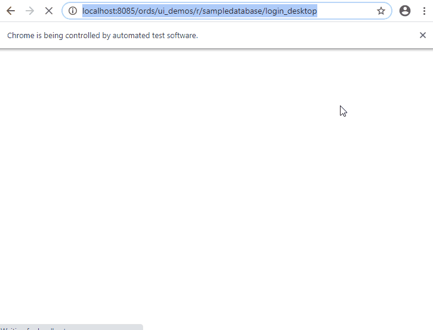
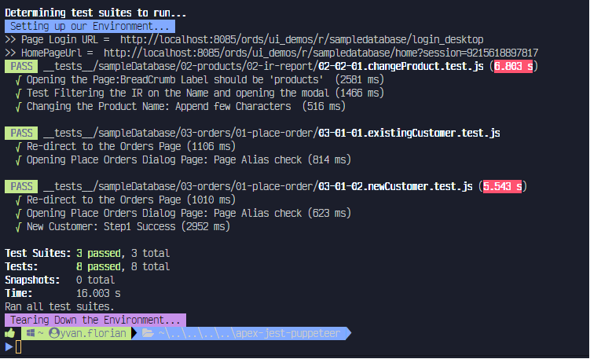

# apex-jest-puppeteer
This is a fully working example on how to setup [Oracle APEX](https://apex.oracle.com/en/) e2e testing automation with [Jest](https://jestjs.io/) &amp; [Puppeteer](https://pptr.dev/).

Below is one sample test to raise an order with a new client with puppeteer running fully.
> headless=false

I blogged about this here:
 1. A Quick Setup of the environment for testing automation and running the first Test with Jest and Puppeteer. [here](https://yvanflorian.wordpress.com/2020/05/29/apex-e2e-testing-automation-with-jest-puppetter-2/) 
 2. Page redirection, an intro to iframe's and a word about Jest's global methods [here](https://yvanflorian.wordpress.com/2020/05/29/apex-e2e-testing-automation-with-jest-puppetter-3/) 
 3. A description of this repository's folder structure and global environment setup as described by the people at Puppeteer [here](https://jestjs.io/docs/en/puppeteer#custom-example-without-jest-puppeteer-preset)

Running all tests with `npm test` will give below `verbose` results:

